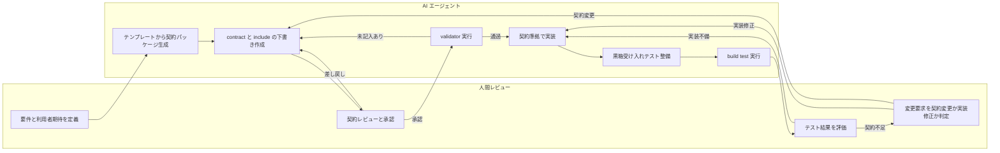

# Contract Workflow Package

このリポジトリには、契約駆動開発のための再利用可能なワークフローパッケージが入っている。

## 含まれるもの

- `.github/copilot-instructions.md` — ワークスペース共通の契約駆動ルール
- `.github/instructions/contract-package.instructions.md` — 契約パッケージ編集時の補助指示
- `.github/agents/contract-package-author.agent.md` — 契約パッケージ作成用エージェント
- `.github/agents/contract-package-implementer.agent.md` — 契約から実装するエージェント
- `.github/prompts/new-contract-package.prompt.md` — 契約パッケージ新規作成プロンプト
- `.github/prompts/implement-from-contract.prompt.md` — 契約から実装するプロンプト
- `.github/prompts/init-cmake-devshell.prompt.md` — VS 開発環境と CMake/Ninja を初期化するプロンプト
- `.github/prompts/build-and-test-cmake.prompt.md` — 指定 preset をビルドとテストするプロンプト
- `scripts/New-ContractPackage.ps1` — テンプレート複製と初期置換
- `scripts/Validate-ContractPackage.ps1` — パッケージの構造と未置換トークン検査
- `scripts/Initialize-VsCMakeEnv.ps1` — VS 開発環境と CMake/Ninja を初期化する
- `scripts/Invoke-CMakePreset.ps1` — preset 指定で configure/build/test を行う

## 基本フロー

1. `scripts/New-ContractPackage.ps1` で `ContractPackage_<name>` を作る
2. `contract/` と `include/` を埋めて契約レビューする
3. `scripts/Validate-ContractPackage.ps1` で未置換トークンを検出する
4. `Contract Package Implementer` か `/Implement From Contract Package` で実装する
5. `tests/` を契約の黒箱テストとして完成させる
6. `scripts/Invoke-CMakePreset.ps1 -Preset x64-debug -Build -Test` でビルドとテストを流す

## 例

```powershell
./scripts/New-ContractPackage.ps1 \
  -PackageName Utf8LineReader \
  -InterfaceName Utf8LineReader \
  -ModuleName textio \
  -PublicHeader Utf8LineReader.h \
  -ImplementationFile Utf8LineReader.cpp \
  -StatusType LineReaderStatus
```

```powershell
./scripts/Validate-ContractPackage.ps1 -PackagePath ./ContractPackage_Utf8LineReader
```

```powershell
./scripts/Invoke-CMakePreset.ps1 -Preset x64-debug -Build -Test
```

## 役割分担

### AI エージェントの責務

- テンプレートから契約パッケージを生成する
- `contract/` と `include/` の整合を保ちながら下書きを作る
- 受け入れ条件を `tests/` の黒箱テスト観点に落とす
- 凍結済み契約だけを根拠に `.cpp` 実装を作る
- `scripts/Validate-ContractPackage.ps1` と `scripts/Invoke-CMakePreset.ps1` を使って構造検証、ビルド、テストを回す
- 契約不足を見つけたら実装で埋めず、契約の不足点として返す

### 人間レビューの責務

- 契約が業務要件と利用者期待を満たしているか判断する
- 所有権、寿命、無効化規則、例外方針、ライフサイクルが妥当か承認する
- エラーモデルが利用者にとって観測可能で十分か判断する
- 受け入れ条件がブラックボックス検証として十分か承認する
- 契約にない振る舞いを追加したい変更要求を、先に契約更新として扱う
- 実装レビューでは内部方式より契約適合性と受け入れテストの妥当性を優先する

## レビューゲート

1. 契約作成直後
AI が下書きを作り、人間が `contract/` と `include/` をレビューする。ここでは実装に進んでよいかだけを判断する。

2. 実装開始前
`scripts/Validate-ContractPackage.ps1` が通ることを確認し、人間が未決事項の有無を確認する。

3. ビルド・テスト後
AI が `scripts/Invoke-CMakePreset.ps1` で build/test を回し、人間は失敗原因が実装不備か契約不足かを切り分ける。

4. 変更要求発生時
実装修正に入る前に、人間が「契約変更か実装修正か」を判断する。契約変更なら `contract/` と `include/` を先に更新する。

## 役割分離フロー



## 運用原則

- AI は契約の穴を推測で埋めない
- 人間は実装の巧拙より、契約が十分かを先に見る
- build 成功は完了条件ではなく、`tests/` の黒箱受け入れ成功まで見る
- 契約とヘッダが凍結される前に実装品質の議論へ進まない
