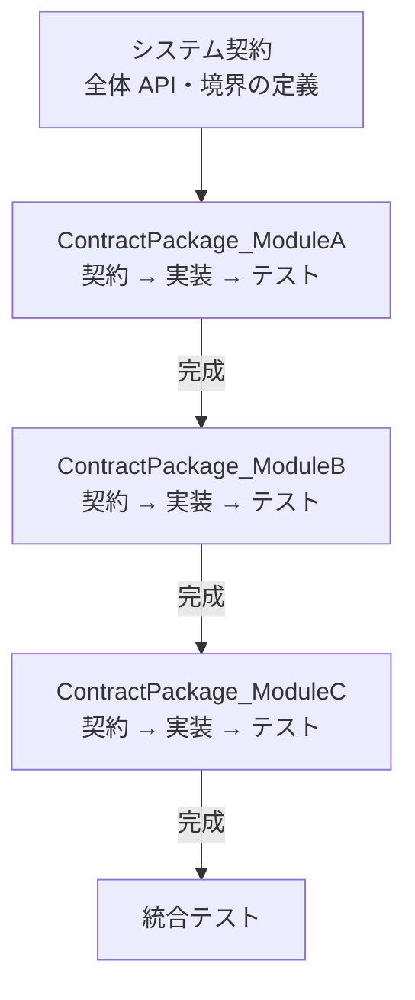
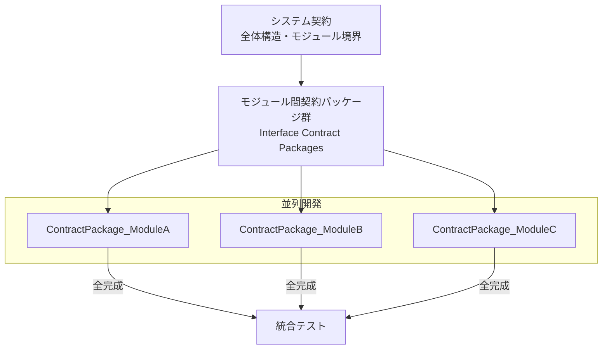
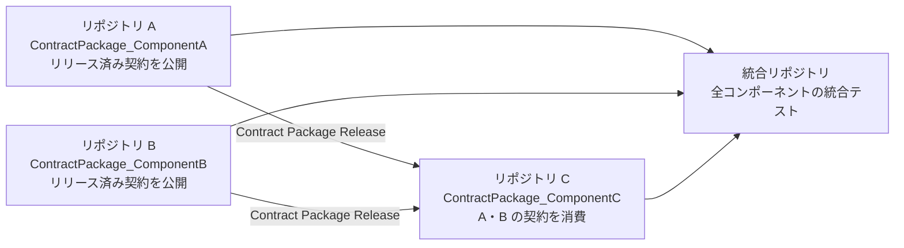
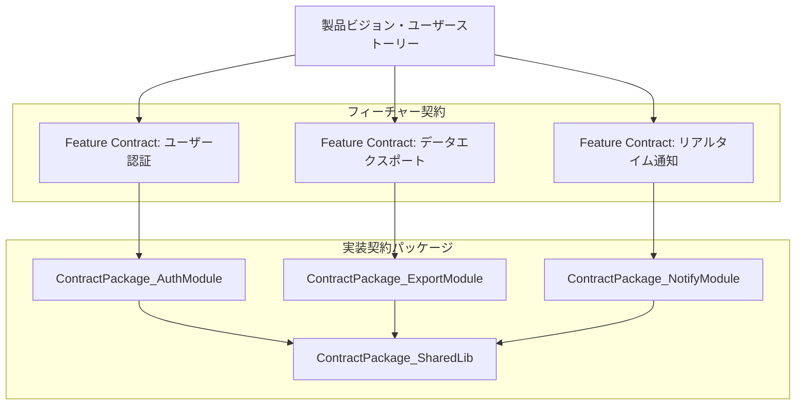

# システム開発全体のワークフロー検討 — ドラフト

> **ステータス**: ドラフト版  
> **目的**: 契約パッケージワークフローをモジュール単体開発から、システム全体の開発に拡張する場合の候補を整理する。

---

## 背景

現在の契約パッケージワークフローは、**1 つのモジュール（クラス／コンポーネント）** を対象とした開発手法として確立されている。

```
要件 → 契約パッケージ作成 → 契約レビュー → 実装 → 黒箱テスト → ビルド/テスト
```

しかし実際のシステム開発では、複数のモジュールが協調し、チームが並列で作業し、依存関係を管理しながら統合する必要がある。本ドキュメントでは、この手法をシステム全体に適用するためのワークフロー候補を複数提示し、それぞれの特徴・メリット・デメリットをまとめる。

---

## 候補一覧

| # | 名称 | ひとことまとめ |
|---|------|---------------|
| A | 単一リポジトリ逐次統合型 | 1 つのリポジトリでモジュールを順番に完成させていく |
| B | 単一リポジトリ並列開発型 | 1 つのリポジトリで複数モジュールを並列開発する |
| C | マルチリポジトリコンポーネント型 | コンポーネントごとにリポジトリを分けて管理する |
| D | フィーチャー駆動型 | 機能単位で契約パッケージを構成し、機能チームが横断開発する |

---

## 候補 A: 単一リポジトリ逐次統合型

### 概要

システム全体を 1 つのリポジトリ（モノリポ）で管理し、モジュールを 1 つずつ順番に開発・統合していく。各モジュールは契約パッケージワークフローに従い、前のモジュールが完成してから次に進む。



### 特徴

- システム全体の契約（上位契約）を先に作り、各モジュール契約はその制約下で作る
- 前のモジュールに依存する後続モジュールは、先に完成した実装を利用できる
- モジュール間の依存関係が一方向に整理されやすい

### メリット

- **シンプルさ**: 状態が明確で、「今どこまで完成したか」が把握しやすい
- **依存関係の安定**: 後続モジュールが利用する前モジュールは完成済みのため、インターフェイス変更リスクが低い
- **レビューの集中**: 一度に 1 モジュールだけ審査すればよく、レビュー負荷が分散される

### デメリット

- **開発速度が遅い**: 並列開発できないため、チームが大きいほど遊休が生まれる
- **先行モジュールへの依存**: 先のモジュールで設計ミスが発覚すると後続全体に影響する
- **スケジュールリスク**: 1 モジュールのブロックがシステム全体を止める

---

## 候補 B: 単一リポジトリ並列開発型

### 概要

1 つのリポジトリでシステム全体を管理し、複数のモジュールを並列で開発する。モジュール間のインターフェイスは「モジュール間契約パッケージ（Interface Contract Package）」として先に凍結し、それを根拠に各チームが並列実装する。



### 特徴

- モジュール間のインターフェイスをモジュール間契約パッケージとして明示的に定義する
- 各チーム・各 AI エージェントは、モジュール間契約を守りながら独立して作業する
- 統合テストは全モジュール完成後に行う

### メリット

- **開発速度**: 並列化でリードタイムを短縮できる
- **独立性**: 各モジュールが互いに干渉しにくい（契約が分離バリアになる）
- **拡張性**: 新モジュール追加がしやすく、システムの成長に追随しやすい

### デメリット

- **モジュール間契約の難易度**: 先にすべてのインターフェイスを凍結する必要があり、設計初期の知識が少ない段階で難しい判断を迫られる
- **統合リスク**: 全モジュール完成まで統合テストができないため、インターフェイスのズレが後になって発覚する
- **変更の波及**: 1 つのインターフェイス変更が複数モジュールに影響し、契約の再凍結・再実装を要する
- **調整コスト**: 並列開発の調整（コンフリクト、共通コードの重複など）が増える

---

## 候補 C: マルチリポジトリコンポーネント型

### 概要

システムを独立したコンポーネントに分割し、それぞれを別リポジトリで管理する。各コンポーネントリポジトリは契約パッケージワークフローで独立開発・リリースし、依存コンポーネントはリリース済み契約パッケージを消費する。統合テストは専用の統合リポジトリで行う。



### 特徴

- コンポーネントはバージョン管理されたリリースとして公開される
- 依存コンポーネントは特定バージョンの契約パッケージを参照する
- チームやリポジトリの所有権が明確に分離される

### メリット

- **独立性が最高**: 各チームが完全に独立して開発・デプロイできる
- **バージョン管理**: 依存コンポーネントのバージョンを固定できるため、安定性が高い
- **再利用性**: リリース済みコンポーネントを別システムでも利用できる
- **オーナーシップの明確化**: リポジトリ境界がチーム責任境界と一致する

### デメリット

- **オーバーヘッドが大きい**: リポジトリ分割・リリース管理・バージョン依存解決の運用コストが高い
- **統合テストの遅さ**: 統合リポジトリでのテストは全コンポーネントのリリースを待つ必要がある
- **契約変更の連鎖**: インターフェイス変更が複数リポジトリのバージョンアップを連鎖させる
- **初期コスト**: リポジトリ、CI/CD、パッケージ管理の初期設定コストが高い

---

## 候補 D: フィーチャー駆動型

### 概要

開発をモジュール単位ではなく「機能（フィーチャー）」単位で構成する。各フィーチャーは独立した契約パッケージ群（フィーチャー契約）を持ち、機能チームがその契約を根拠に横断的に開発する。モジュールはフィーチャー契約の実装手段として内部化される。



### 特徴

- ユーザー価値（機能）から契約を逆算するトップダウンアプローチ
- フィーチャーチームが UI・ビジネスロジック・インフラを横断して担当する
- 共通ライブラリは独立した契約パッケージとして分離する

### メリット

- **ユーザー価値との直結**: フィーチャー契約が「何を達成するか」を明文化するため、ビジネス要件との整合が取りやすい
- **完結性**: フィーチャー単位で完結するため、部分的なリリースがしやすい
- **チームの自律性**: フィーチャーチームが技術スタックを横断して意思決定できる

### デメリット

- **フィーチャー間の重複**: 複数フィーチャーが同じ基盤コンポーネントを必要とする場合、責任が曖昧になる
- **フィーチャー契約の粒度**: どこまでをフィーチャー契約にするかの設計が難しく、細かすぎると管理コスト増、粗すぎると実装契約と分離できない
- **モジュール境界の不明確さ**: フィーチャーをまたぐモジュール共有が発生すると、所有権と変更権限が曖昧になる
- **スケーリングの難しさ**: フィーチャーが増えると契約パッケージ数が急増し、全体の見通しが悪くなる

---

## 比較まとめ

| 観点 | A: 逐次統合 | B: 並列開発 | C: マルチリポジトリ | D: フィーチャー駆動 |
|------|------------|------------|------------------|------------------|
| 開発速度 | 低 | 高 | 高 | 中 |
| チーム規模への適合 | 小〜中 | 中〜大 | 大 | 中〜大 |
| 設計初期コスト | 低 | 中〜高 | 高 | 中 |
| 統合リスク | 低 | 中 | 中〜高 | 中 |
| 運用コスト | 低 | 中 | 高 | 中 |
| 再利用性 | 低 | 中 | 高 | 中 |
| 契約の変更容易性 | 高 | 低〜中 | 低 | 中 |
| ユーザー価値との整合 | 低 | 低〜中 | 低 | 高 |

---

## 初期推奨

プロジェクト規模・チーム構成によって選択が変わるが、ドラフト段階での初期案は以下の通り：

- **小規模 / 1〜2 名**: 候補 A（逐次統合型）が最も低コストで始めやすい
- **中規模 / 3〜8 名**: 候補 B（並列開発型）でモジュール間契約を先に凍結し、並列化を活用する
- **大規模 / 複数チーム**: 候補 C（マルチリポジトリ型）でチーム間の境界を明確にする
- **プロダクト指向 / ユーザー機能重視**: 候補 D（フィーチャー駆動型）でユーザー価値を契約の起点にする

---

*次: [02_review.md](02_review.md) — ドラフトレビュー*
