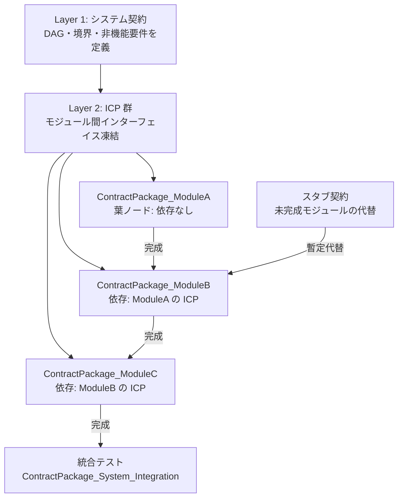
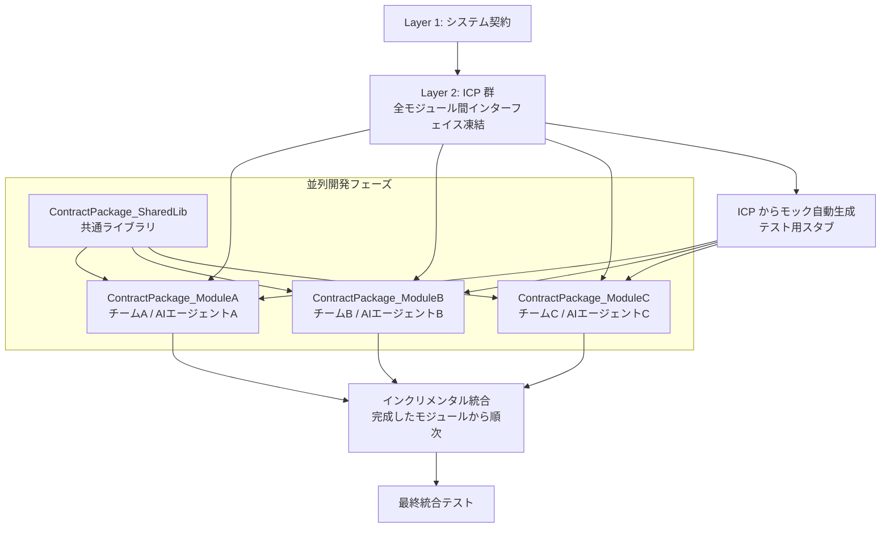
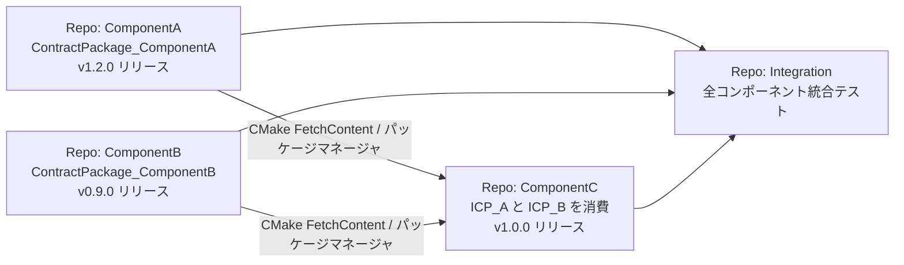
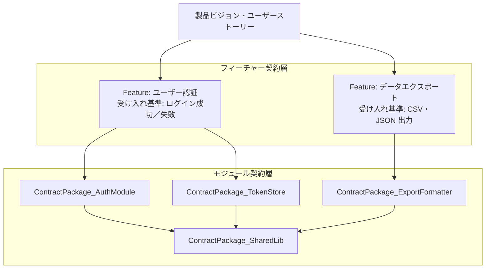
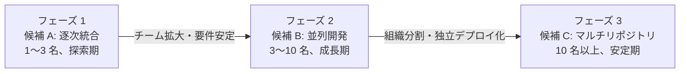

# システム開発全体のワークフロー検討 — 改善版

> **ステータス**: 改善版（レビュー反映済み）  
> **前版**: [01_draft.md](01_draft.md)  
> **レビュー記録**: [02_review.md](02_review.md)

---

## 背景と目的

現在の契約パッケージワークフローは 1 つのモジュール（クラス／コンポーネント）を対象とした開発手法として確立されている。本ドキュメントでは、この手法をシステム全体の開発に拡張するためのワークフロー候補を、レビューフィードバックを反映した上で整理する。

### 対象読者

- C++ システムを契約先行ワークフローで開発しようとするチーム
- 現行の単一モジュールワークフローをシステム規模に拡張したいエンジニア

---

## 契約の階層構造（共通前提）

どの候補においても、契約は以下の 3 層で構成される。この階層が、システム全体に契約パッケージワークフローを適用する際の共通基盤となる。

```
┌────────────────────────────────────────┐
│  Layer 1: システム契約                  │  ← アーキテクチャ・境界・依存方向を定義
│  (System Contract)                     │
├────────────────────────────────────────┤
│  Layer 2: モジュール間契約              │  ← モジュール間 API を凍結
│  (Interface Contract Packages: ICP)    │
├────────────────────────────────────────┤
│  Layer 3: モジュール内契約              │  ← 各モジュールの実装契約
│  (ContractPackage_<Module>)            │
└────────────────────────────────────────┘
```

### Layer 1: システム契約

システム全体の構造を文書化する。現行の `ContractPackage_Template` とは別に、以下の内容を持つ。

| 項目 | 内容 |
|------|------|
| システム境界 | システムが外部に提供する API・サービス境界 |
| モジュール分割 | 主要モジュールとその責務 |
| 依存方向 | モジュール間の依存は有向非循環グラフ（DAG）で定義し循環を禁止 |
| 非機能要件 | パフォーマンス、セキュリティ、エラー方針など |
| ADR | アーキテクチャ決定記録（なぜその設計にしたか） |

### Layer 2: モジュール間契約パッケージ（ICP）

モジュール A がモジュール B に依存する場合、その境界を `ContractPackage_<A>_<B>_Interface` として定義する。現行テンプレートを流用し、`include/` にインターフェイスヘッダを凍結する。実装は各モジュールが行う。

### Layer 3: モジュール内契約パッケージ

現行の `ContractPackage_Template` ワークフローをそのまま適用する。

---

## 候補 A: 単一リポジトリ逐次統合型（改善版）

### 概要

1 つのリポジトリで管理し、依存 DAG の葉ノードから順にモジュールを完成させ、逐次統合する。



### スタブ・モック戦略

並列化しない場合でも、後続モジュールの開発中に先行モジュールが未完成の場合がある。この場合は **スタブ契約パッケージ** を活用する。

- ICP の `include/` ヘッダのみを凍結した状態で、最小限のスタブ実装を提供する
- スタブは契約に準拠した振る舞いを返すが、実際の処理は行わない
- 先行モジュールの実装が完成したら、スタブから実装に差し替える

### 統合テストの位置づけ

統合テストは `ContractPackage_System_Integration` として扱い、以下を検証する。

- 各モジュールが Layer 1 のシステム境界 API を満たすか
- モジュール間の ICP が実際の呼び出しで機能するか
- 非機能要件（エラー方針、ライフサイクルなど）がシステム全体で一貫しているか

### 特徴・メリット・デメリット

| 観点 | 内容 |
|------|------|
| 適合チーム規模 | 小〜中（1〜5 名） |
| 開発速度 | 低（直列化による制約） |
| 統合リスク | 低（逐次完成のため早期に発見） |
| 設計初期コスト | 低〜中（システム契約と ICP の定義が必要） |
| 運用コスト | 低（単一リポジトリ） |
| 既存ツールとの親和性 | 高（スクリプト・テンプレートをそのまま利用可） |

---

## 候補 B: 単一リポジトリ並列開発型（改善版）

### 概要

1 つのリポジトリで管理し、Layer 2 の ICP を先に凍結した上で、複数チーム・複数 AI エージェントが並列でモジュールを実装する。インクリメンタル統合で早期に不整合を検出する。



### ICP 作成フロー（候補 B 固有）

ICP を先に凍結するためのフローを明示する。

```
1. システム契約（Layer 1）でモジュール境界を定義
2. 各境界ごとに ICP を New-ContractPackage.ps1 で生成
3. ICP の include/ ヘッダをチームレビューで凍結
4. Validate-ContractPackage.ps1 で ICP の構造を確認
5. ICP から各モジュール向けのモック生成（手動または自動化ツール）
6. 各チームが ICP を根拠に並列で ContractPackage_<Module> を作成・実装
```

### モック自動生成

ICP の `include/` ヘッダから Google Mock 等を用いてモックを生成し、各チームが依存モジュールの実装なしにテストできる環境を整える。

### インクリメンタル統合

全モジュールの完成を待たず、完成したモジュールから順次統合テストに組み込む。各統合ポイントで ICP の整合性を再確認する。

### 共通ライブラリの扱い

複数モジュールが依存する共通コード（ユーティリティ、共通型定義など）は `ContractPackage_SharedLib` として分離し、最初に凍結する。

### 特徴・メリット・デメリット

| 観点 | 内容 |
|------|------|
| 適合チーム規模 | 中〜大（3〜15 名） |
| 開発速度 | 高（並列化） |
| 統合リスク | 中（ICP 凍結後の変更コストが高い） |
| 設計初期コスト | 中〜高（全 ICP の先行設計が必要） |
| 運用コスト | 中（モノリポだが並列調整が必要） |
| 既存ツールとの親和性 | 高（ICP も同じスクリプトで生成可） |

---

## 候補 C: マルチリポジトリコンポーネント型（改善版）

### 概要

大規模チームや複数チームが長期間にわたって開発する場合に適する。コンポーネントをリポジトリ単位で独立管理し、ICP はリリース済みパッケージとして公開する。



### 契約パッケージのリリース管理

各リポジトリは以下を成果物としてリリースする。

| 成果物 | 内容 |
|--------|------|
| `include/` ヘッダ | 凍結済み公開 API（インターフェイスとして消費） |
| `contract/` ドキュメント | 機械可読な契約定義（参照用） |
| `tests/` 黒箱テスト | 利用者がコンプライアンス確認に使えるテスト群 |
| CMake Find モジュール | 依存側が `find_package()` で組み込める設定 |

### ツール選択指針

| ツール | 向いている場面 |
|--------|---------------|
| CMake FetchContent | ヘッダのみのライブラリを組み込む場合 |
| git submodule | リポジトリ間の特定コミットを固定したい場合 |
| vcpkg / Conan | バイナリ配布・バージョン管理を組織横断で行う場合 |

### 変更管理・後方互換性

ICP に破壊的変更（API 変更）が生じた場合は以下の手順に従う。

1. 変更理由を Layer 1 のシステム契約の ADR に記録
2. 新しい ICP バージョンを作成し、旧バージョンを非推奨マーク
3. 依存リポジトリに変更通知し、移行期間を設ける
4. 旧バージョンの ICP を一定期間後に廃止

### 特徴・メリット・デメリット

| 観点 | 内容 |
|------|------|
| 適合チーム規模 | 大（5 名以上、複数チーム） |
| 開発速度 | 高（完全な独立性） |
| 統合リスク | 中〜高（リポジトリ間の遅延） |
| 設計初期コスト | 高（リポジトリ・CI/CD・パッケージ基盤） |
| 運用コスト | 高（バージョン管理・移行コスト） |
| 既存ツールとの親和性 | 中（各リポジトリで既存スクリプトを流用できるが、リリース管理は追加整備が必要） |

---

## 候補 D: フィーチャー駆動型（改善版）

### 概要

開発をユーザー機能（フィーチャー）単位で構成する。フィーチャー契約がユーザー価値を定義し、その実現に必要なモジュール契約パッケージを逆算する。



### フィーチャー契約のフォーマット

フィーチャー契約は現行の `ContractPackage_Template` とは別形式で管理し、以下の内容を持つ。

```markdown
# Feature Contract: <フィーチャー名>

## ユーザーストーリー
As a <ユーザー種別>, I want <機能>, so that <目的>.

## 受け入れ基準
- [ ] シナリオ A: <条件> のとき <期待結果>
- [ ] シナリオ B: <条件> のとき <期待結果>

## 依存モジュール契約
- ContractPackage_<Module>: <理由>

## 正本
モジュール契約パッケージ（ContractPackage_*）が仕様の正本。
フィーチャー契約はユーザー要件の追跡・ドキュメントとして機能する。
```

### 二重管理の解消

フィーチャー契約は「何を達成するか（ユーザー視点）」、モジュール契約パッケージは「どう実現するか（技術視点）」として役割を分離し、モジュール契約パッケージを仕様の正本とする。フィーチャー契約はトレーサビリティのためのドキュメントとして位置づける。

### 特徴・メリット・デメリット

| 観点 | 内容 |
|------|------|
| 適合チーム規模 | 中〜大（プロダクト指向） |
| 開発速度 | 中（フィーチャー契約設計に時間を要する） |
| 統合リスク | 中（フィーチャー境界で整合を確認可能） |
| 設計初期コスト | 中（フィーチャー契約フォーマットの習熟が必要） |
| 運用コスト | 中（フィーチャーとモジュールの二層管理） |
| 既存ツールとの親和性 | 中（モジュール層は既存スクリプトをそのまま利用可） |

---

## 候補 E: 段階移行型ハイブリッド（新規追加）

> レビューで指摘された「現実的なプロジェクトではハイブリッドが有効」を受けて追加した候補。

### 概要

プロジェクトの成長に合わせてワークフローを段階的に移行する。小規模スタートから始め、チームや要求が成長するにつれて候補 A → B → C へと進化させる。



### 各フェーズの移行トリガー

| フェーズ移行 | 移行トリガー |
|-------------|------------|
| A → B | チームが 3 名超・並列開発のニーズが発生 |
| B → C | チームが組織として独立・独立デプロイが必要・コンポーネントの再利用要求 |

### 移行時の注意点

- フェーズ移行時に Layer 1 システム契約と ICP を見直し・再凍結する
- 移行は段階的に行い、すべてを一度に移行しない
- 移行前後で統合テストの通過を確認する

### 特徴・メリット・デメリット

| 観点 | 内容 |
|------|------|
| 適合チーム規模 | 全規模（段階的に拡張） |
| 開発速度 | フェーズによる |
| 統合リスク | フェーズ移行時が最大 |
| 設計初期コスト | 低（最初は候補 A から始める） |
| 運用コスト | フェーズによる |
| 既存ツールとの親和性 | 高（どのフェーズでも既存ツールを継続利用可） |

---

## AI エージェントのシステムレベル役割

システム全体に契約パッケージワークフローを適用する場合、AI エージェントには以下の新しい役割が追加される。

| 役割 | 内容 |
|------|------|
| システム契約の下書き | Layer 1 のシステム契約ドキュメントの初期案を作成する |
| ICP の生成 | モジュール境界から ICP を `New-ContractPackage.ps1` で生成する |
| 整合性検査 | 複数の ContractPackage 間で型名・エラーモデル・命名の一貫性を確認する |
| モック生成 | ICP から各モジュール向けのモック・スタブを生成する |
| 依存 DAG 検証 | モジュール間の依存関係が循環を含まないか検証する |

---

## 比較まとめ（改善版）

| 観点 | A: 逐次統合 | B: 並列開発 | C: マルチリポジトリ | D: フィーチャー駆動 | E: 段階移行 |
|------|------------|------------|------------------|------------------|------------|
| 適合チーム規模 | 小〜中 | 中〜大 | 大 | 中〜大 | 全規模 |
| 開発速度 | 低 | 高 | 高 | 中 | フェーズ次第 |
| 統合リスク | 低 | 中 | 中〜高 | 中 | 移行時中 |
| 設計初期コスト | 低〜中 | 中〜高 | 高 | 中 | 低 |
| 運用コスト | 低 | 中 | 高 | 中 | フェーズ次第 |
| 契約変更容易性 | 高 | 低〜中 | 低 | 中 | 中 |
| ユーザー価値との整合 | 低 | 低〜中 | 低 | 高 | 中 |
| 既存ツール親和性 | 高 | 高 | 中 | 中 | 高 |
| 再利用性 | 低 | 中 | 高 | 中 | 中〜高 |

> 評価基準: **低**=他候補に比べて不利、**中**=標準的、**高**=他候補に比べて優位。相対比較であり絶対評価ではない。

---

## 選択ガイド

```
チームが 1〜3 名で探索期にある
  → 候補 A（逐次統合型）から始める
  → 安定してきたら 候補 E（段階移行）で拡張を計画する

チームが 3〜15 名で並列開発が必要
  → 候補 B（並列開発型）を採用
  → ICP の先行凍結に注意を払う

複数チームが独立して長期開発する大規模プロジェクト
  → 候補 C（マルチリポジトリ型）
  → リリース管理基盤を先に整備する

ユーザー価値・プロダクト思考が重要な開発
  → 候補 D（フィーチャー駆動型）を採用
  → モジュール契約パッケージを仕様の正本として維持する

将来の成長を見越してスモールスタートしたい
  → 候補 E（段階移行型）で A から始め、必要に応じて B→C へ移行する
```

---

*前: [02_review.md](02_review.md) — ドラフトレビュー*  
*初稿: [01_draft.md](01_draft.md) — ドラフト版*
